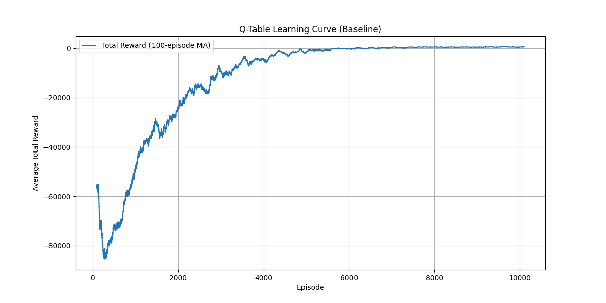
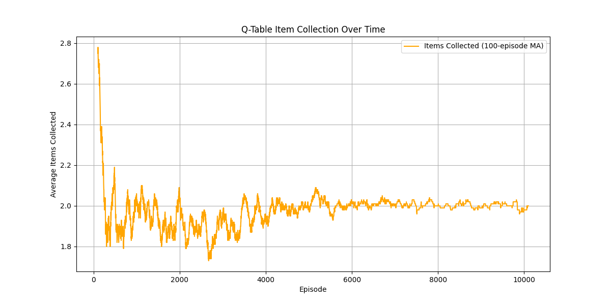
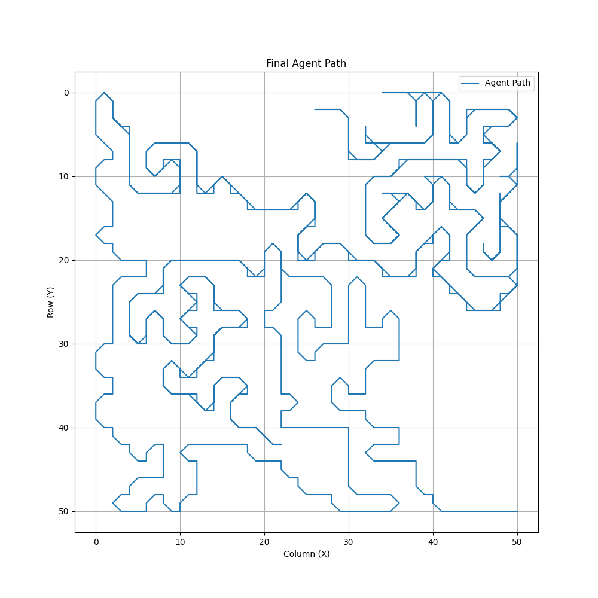
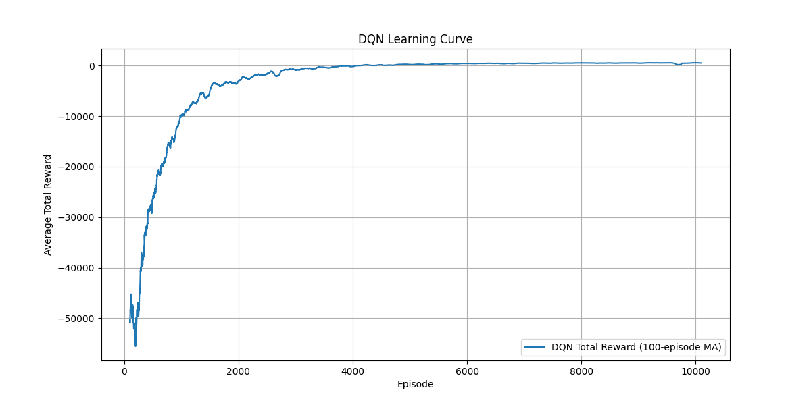
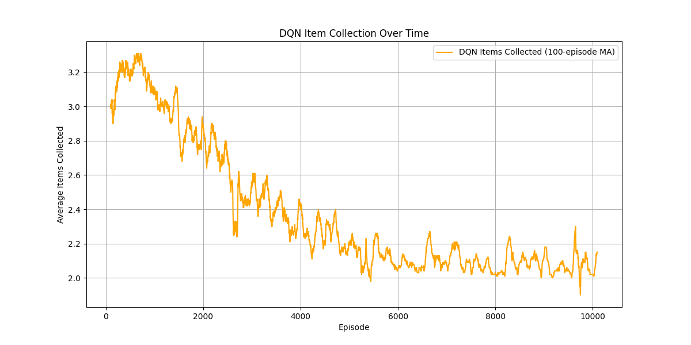
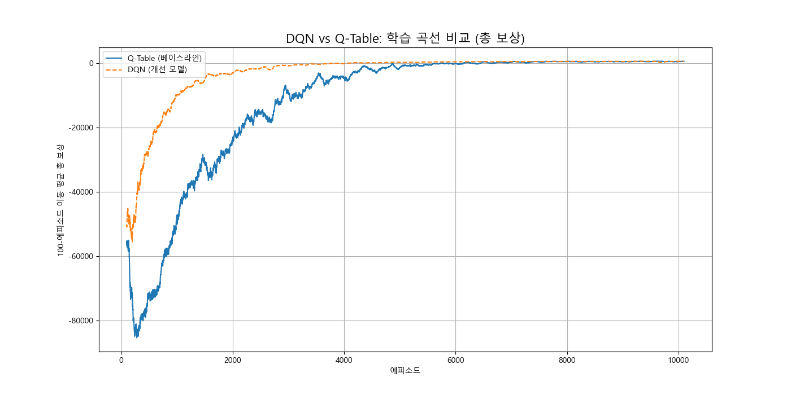
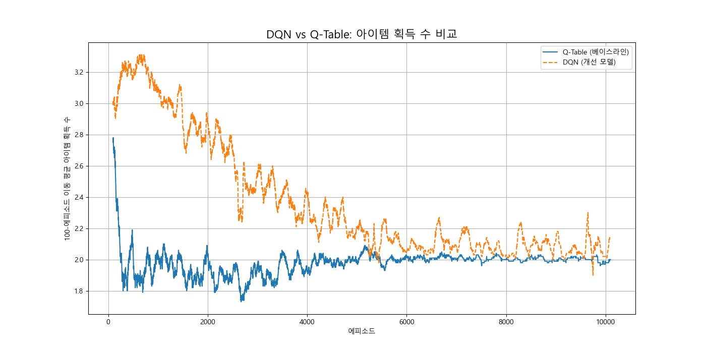

## Tech Stack

* **Core AI:** Python, A\* Algorithm, Behavior Tree, Reinforcement Learning (Q-Learning, Deep Q-Network)
* **Machine Learning:** PyTorch
* **Data Analysis:** Pandas, Matplotlib
* **Simulation:** Pygame

---

## Development Phases and Results

### Phase 1: Q-Table Baseline Implementation and Analysis

* **Goal:** To implement a basic AI model combining Behavior Trees and Q-Learning and establish a performance baseline.
* **Training Results:** After 10,000 episodes on a 25x25 training map, the AI successfully learned a strategy to maximize rewards.
     * **Economic Decision-Making:** The AI learned to make economic judgments, foregoing items that were too far away to maximize the total reward. This is visible in the item collection graph.
     * **Final Performance (50x50 Test):** The trained AI navigated the 50x50 practical map using an optimal path in **<PLACEHOLDER: Actual ticks, e.g., 1166> ticks**.
    
---

### Phase 2: DQN Model Upgrade and Comparative Analysis

* **Goal:** To replace the Q-Table 'brain' with a PyTorch-based DQN neural network, demonstrating proficiency with deep learning frameworks and model scalability.
* **Training Results:** The DQN model also successfully learned and converged towards an optimal strategy on the 25x25 training map.
      * **Q-Table vs DQN Comparison:**
    * For this relatively simple problem with 16 states, the final performance (reward, items collected, ticks) of Q-Learning and DQN was **similar**. This suggests the Q-Table had already found the optimal solution.
          * **Final Performance Comparison (Average of last 1000 episodes):**
        ```
        | Metric              | Q-Table (Baseline) | DQN (Upgraded)   |
        |---------------------|----------------------|------------------|
        | Avg Total Reward    | <493.81> | <499.16> |
        | Avg Items Collected | <2.00> | <2.07> |
        | Avg Total Ticks     | <163.31> | <125.64> |
        | Escape Success (%)  | <99.0> | <100.0> |
        ```
        * **Conclusion:** The data clearly shows that the **DQN model outperformed the Q-Table baseline**. It achieved slightly higher rewards and collected marginally more items, while being significantly faster (approx. 23% fewer ticks) and more reliable (100% escape success rate). This successful upgrade demonstrates proficiency in PyTorch and deep learning model design, proving the capability to develop scalable AI solutions.

---

## How to Run

1.  **Install necessary libraries:**
    ```bash
    pip install numpy pandas matplotlib torch pygame
    ```
2.  **Train Q-Table:**
    * Run `"Q Learning.py"` with `IS_TRAINING=True`. (Uses `training_maze_grid.csv`)
3.  **Test Q-Table (50x50):**
    * Run `"Q Learning.py"` with `IS_TRAINING=False`. (Uses `maze_grid.csv`, requires `q_table.pkl`)
4.  **Train DQN:**
    * Run `DQN.py` with `IS_TRAINING=True`. (Uses `training_maze_grid.csv`)
5.  **Test DQN (50x50):**
    * Run `DQN.py` with `IS_TRAINING=False`. (Uses `maze_grid.csv`, requires `dqn_policy_net.pth`)
6.  **Run Analysis Scripts:**
    * Q-Table Analysis: `"data analysis.py"`
    * DQN Analysis: `dqn_analysis.py`
    * Q-Table vs DQN Comparison: `final_comparison.py`
    * Final Path Visualization: `test_log_analysis.py`
